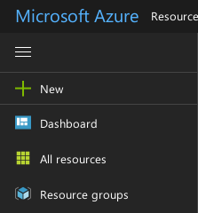
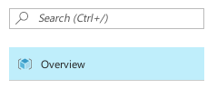

## 単純なクラスタのデプロイ

Standard_A1 サイズのマシンを４つ作ります。
コアは４使用することになります。

立ち上がるところの評価用です。


docker と、ジョブスケジューラと、使わないリソースを自動で落とすものが入っています

<a href="https://portal.azure.com/#create/Microsoft.Template/uri/https%3A%2F%2Fraw.githubusercontent.com%2Fmanabuishii%2Fazure-files%2Fmaster%2Fsmall_set%2Fazuredeploy.json" target="_blank">
    
</a>

# 注意点など

遷移した後、いろいろ入力しますが、
最後の購入ボタンを押す前に、"Terms and conditions" への同意へのチェックも忘れずに。


## デプロイしたマシンのアドレスを調べる

### ウェブで確認する

1. portal サイトの、左がわのメニューから `Resouce Groups` (リソースグループ)をクリックし、



2. Overview をクリック、



3. `sshPublicIIP` をクリック


### コマンドライン


azure cli のコマンドラインがつかえるのであれば

```
azure network public-ip list -g 作成したリソースグループ
```

で、確認ができます。


## ジョブを投入したが、なかなか実行されない。

自動で落とすタイミングとかさなってしまうと、
マシンを落として、立ち上がるまで待つ必要があります。

またそのあとも、少し待つ必要があるときがあります。

`qstat` の状況としては、以下のようにジョブのステータスが `t` になります。

```
manabu@master:~$ qstat
job-ID  prior   name       user         state submit/start at     queue                          slots ja-task-ID 
-----------------------------------------------------------------------------------------------------------------
      1 1.00000 STDIN      manabu       t     10/20/2017 01:46:45 default@exec-0                     1        
      2 1.00000 STDIN      manabu       t     10/20/2017 01:46:45 default@exec-1                     1        
      3 0.66667 STDIN      manabu       qw    10/20/2017 01:46:39                                    1        
      4 0.50000 STDIN      manabu       qw    10/20/2017 01:46:40                                    1        
      5 0.40000 STDIN      manabu       qw    10/20/2017 01:46:40   
```