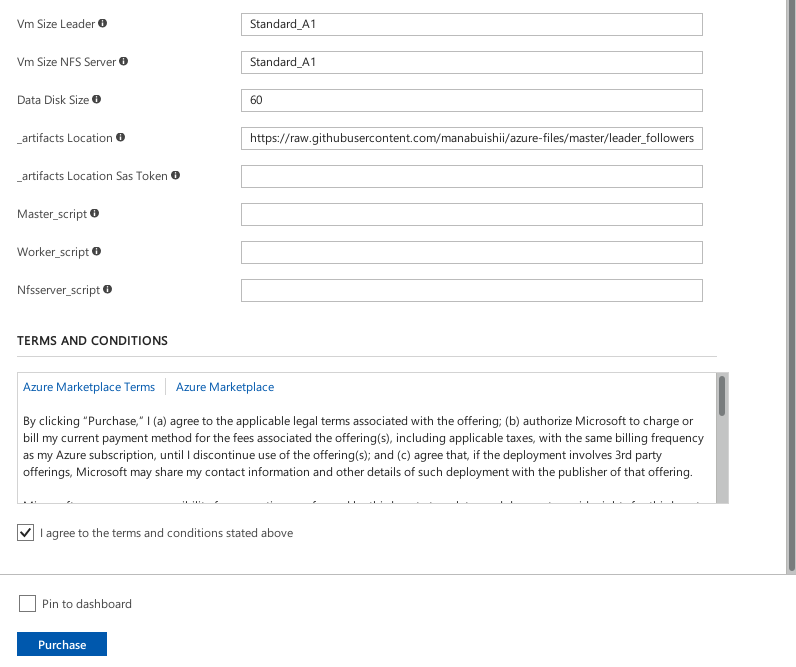

## 単純なクラスタのデプロイ

Standard_A1 サイズのマシンを４つ作ります。
コアは４使用することになります。

立ち上がるところの評価用です。

docker と、ジョブスケジューラと、使わないリソースを自動で落とすものが入っています

遷移した後、いろいろ入力しますが、
最後の購入ボタンを押す前に、"Terms and conditions" への同意へのチェックも忘れずに。

